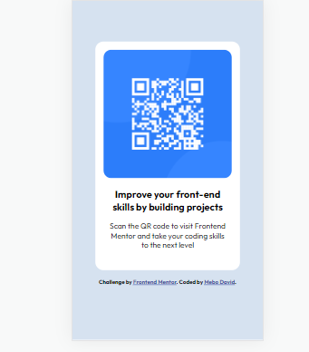
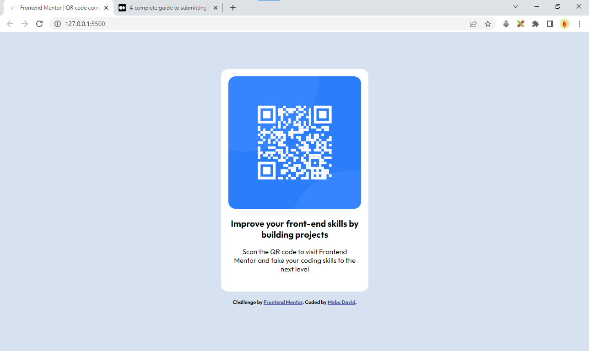

# Frontend Mentor - QR code component solution

This is a solution to the [QR code component challenge on Frontend Mentor](https://www.frontendmentor.io/challenges/qr-code-component-iux_sIO_H). Frontend Mentor challenges help you improve your coding skills by building realistic projects.

## Table of contents

- [Overview](#overview)
  - [Screenshots](#screenshots)
  - [Links](#links)
- [My process](#my-process)
  - [Built with](#built-with)
  - [What I learned](#what-i-learned)
- [Author](#author)

## Overview

QR landing page.

### Screenshots




### Links

- Live Site URL: [GitHub Pages](https://meistens.github.io/qr-component/)

## My process

Started out by setting the styles given, experimented with some css properties (Flexbox) but could not get it to stick for some reason. Wanted to use Grid but that felt excessive. Instead, I made the main section relative, then proceeded to use the top property to center it.

### Built with

- Semantic HTML5 markup
- CSS properties

### What I learned

Learnt some stuff while building this, like this hsl color code below and other stuff like height properties. Also, giving a child element a viewport height seemed to give the viewport a scroll property but figured that the height set at auto or given a set percentage value worked for the task. Everything seeems more clear if practiced.

```css
body {
  background: hsl(212, 45%, 89%);
}
```

## Author

- Frontend Mentor - [@meistens](https://www.frontendmentor.io/profile/meistens)
- Twitter - [@ItzkrazyDave](https://www.twitter.com/ItzkrazyDave)
