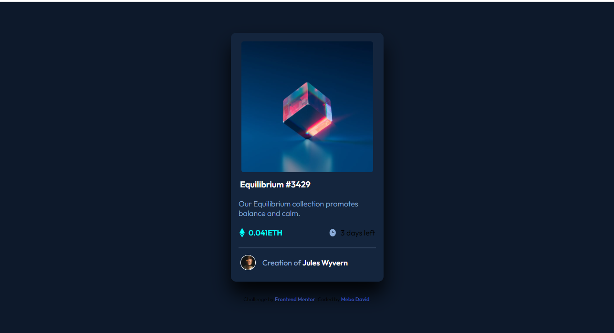

# Frontend Mentor - NFT preview card component solution

This is a solution to the [NFT preview card component challenge on Frontend Mentor](https://www.frontendmentor.io/challenges/nft-preview-card-component-SbdUL_w0U). Frontend Mentor challenges help you improve your coding skills by building realistic projects.

## Table of contents

- [Overview](#overview)
  - [The challenge](#the-challenge)
  - [Screenshot](#screenshot)
  - [Links](#links)
- [My process](#my-process)
  - [Built with](#built-with)
  - [What I learned](#what-i-learned)
  - [Continued development](#continued-development)
  - [Useful resources](#useful-resources)
- [Author](#author)

## Overview

### The challenge

Major challenge faced was trying to overlay the image while making it clickable without using resorting to using a cursor property or some hacky(?) way, which I did. More on [**what I learned**](#what-i-learned).

### Screenshot




### Links

- Solution URL: [Add solution URL here](https://github.com/meistens/Basic-component-page/tree/master/nft-preview-card-component-main)
- Live Site URL: [Vercel](https://mynftpreview.vercel.app)

## My process

1. Created a folder for my CSS stylesheet.
2. Built the HTML structure, starting with using semantic structures where necessary
3. Added the styles I felt was needed to the stylesheet. See [**here**](#what-i-learned) for more.

### Built with

- Semantic HTML5 markup
- CSS custom properties
- Flexbox
- Mobile-first workflow

### What I learned

This challenge, while it looked basic, trying to overlay the colours was so-so. Initially, I tried using the before and  after property after looking it up [**on css-tricks**](css-tricks.com/7-practical-uses-for-the-before-and-after-pseudo-elements-in-css/). While it did worked, I was using it all wrong. Here's how.

```css
.img-box::before {
content:"";
}
```

Realized I was doing it all wrong when I watched a video that explained how the ::after element worked.

```css
.img-box a::before {
content:"";
}
```

Above worked well. Also got to see css specificity in action when i tried adding a focus and hover selector on the h1 element.

### Continued development

I plan to come back and rebuild all existing projects once i get the hang of sass. Though it can be learned in a couple of hours, but the real test is me applying it in future challenges.

### Useful resources

- [css-tricks](css-tricks.com/7-practical-uses-for-the-before-and-after-pseudo-elements-in-css/).
Helped tremendously while I was trying to use the ::before and ::after pseudo elements.

- [Bryan Robinson](https://youtu.be/SXQ9IOScDEA).
Made it perfectly clear while using the ::after element, plus where I realized I was not actually targeting the element I wanted to style.

## Author

- Frontend Mentor - [@meistens](https://www.frontendmentor.io/profile/meistens)
- Twitter - [@itzKrazyDave](https://www.twitter.com/itzKrazyDave)
