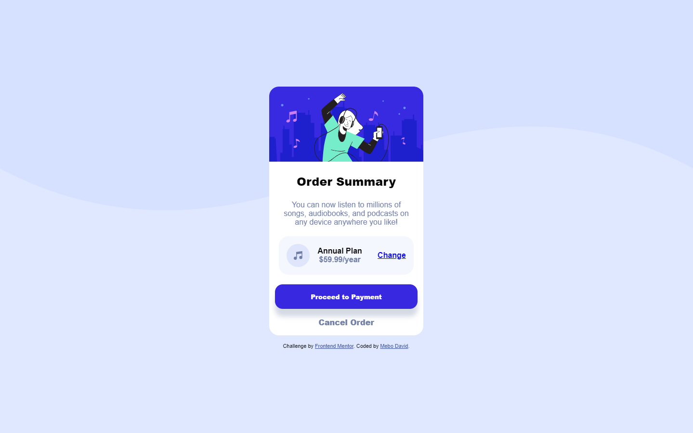

# Frontend Mentor - Order summary card solution

This is a solution to the [Order summary card challenge on Frontend Mentor](https://www.frontendmentor.io/challenges/order-summary-component-QlPmajDUj). Frontend Mentor challenges help you improve your coding skills by building realistic projects.

## Table of contents

- [Overview](#overview)
  - [The challenge](#the-challenge)
  - [Screenshot](#screenshot)
  - [Links](#links)
- [My process](#my-process)
  - [Built with](#built-with)
  - [What I learned](#what-i-learned)
  - [Continued development](#continued-development)
  - [Useful resources](#useful-resources)
- [Author](#author)

## Overview

### The challenge

The challenge, albeit looking easy, was a tough one but thank God for the internet.

### Screenshot

### Links

- Solution URL: [Add solution URL here](https://)
- Live Site URL: [Vercel](https://ordersummary-five.vercel.app)

## My process

First challenge completed by building using a Mobile-first approach, felt way different and confusing at first, probably what made it so-so for me but all the same, wasn't bad.

### Built with

- Semantic HTML5 markup
- CSS custom properties
- Flexbox
- CSS Grid
- Mobile-first workflow

### What I learned

This exercise was a challenge to me (sounds silly, I know), probably due to me stuck in "tutorial hell", being sturbbon on using Grid instead of Fexbox for the layout or both.

Forgot to add, discovered LT Browser and it has been a great experience. Though it is not the ideal way for coding production-wise as I cannot fully test (or never... still dyor on it though) for crossbrowser functionality, though it helped me discover a bug Chrome conviently "hid", it is way better in helping me give a clear visual on how it would look like on others instead of basing the design off the potato laptop I'm managing which, after checking, looks horrible.

Ah well, better days ahead, hopefully.

Bottomine, did some refresher and figured it out, using implict Grid to solve the layout issue.

### Continued development

In the future maybe, when I am more comfortable with Grid, might rewrite the code.

Also, I will make it optimized for larger screens (1920px up to 4K.) and maybe HD displays. Will update as I progress.

### Useful resources

- [css-tricks](https://www.css-tricks.com) - Helped with relearning more on implict and explict Grids.

## Author

- Frontend Mentor - [@meistens](https://www.frontendmentor.io/profile/meistens)
- Twitter - [@itzKrazyDave](https://www.twitter.com/itzKrazyDave)
